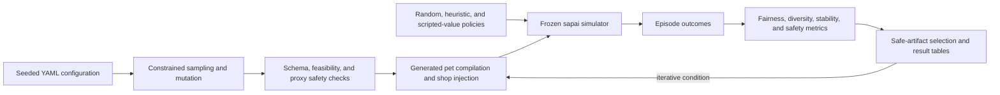
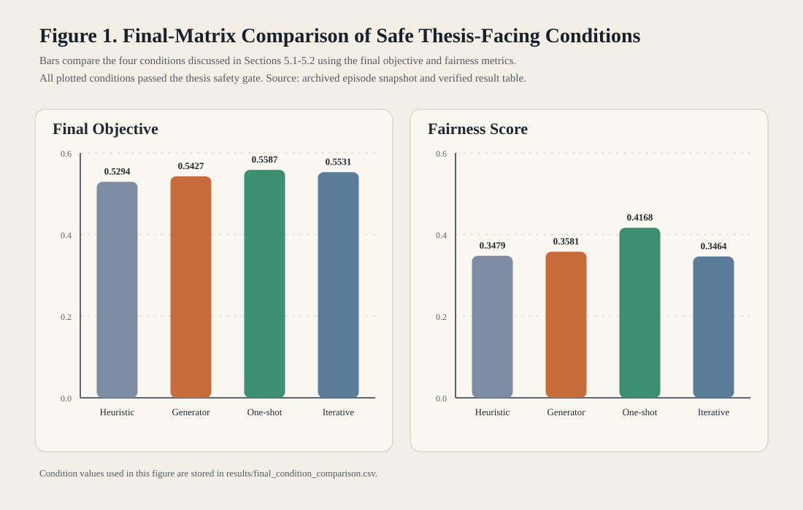

# Balance Through Constrained Procedural Content Generation in Super Auto Pets

This undergraduate thesis studies whether constrained procedural generation of synthetic Super Auto Pets-compatible pets can improve a study-specific balance objective in a frozen simulator while preserving team-composition diversity.
The system uses deterministic sampling and mutation, validation, simulator injection, and matched seeded evaluations.
It does not modify the live game, train a neural model, or use a player dataset.

## Research question and scope

The primary question is: can constrained procedural generation reduce measured imbalance while preserving strategic diversity in a fixed, reproducible Super Auto Pets simulation environment?
Secondary questions compare one-shot and iterative generation and examine transfer across opponent policies, seeds, and two pack settings.

For this thesis, I implemented the deterministic environment wrapper, generated-pet schema and validators, artifact compilation and shop injection, evaluation policies, balance metrics, safety gates, search procedure, experiment runners, and result-export tools.
The underlying game simulator is a vendored runtime subset of the open-source `sapai` project and is not my original work.

## System architecture



The generator is deterministic constrained random search with local mutation.
Proxy scores guide candidate search, but the thesis-facing objective and safety decision are calculated from simulator outcomes.

## Experiment design

The experiments compare no generation, random valid generation, a fixed hand-authored heuristic artifact, a dedicated generator search, one-shot generation, iterative generation, and selected-artifact transfer.
The main matched protocol used StandardPack, three policy families, and eight comparison seeds, producing 24 episode cells for each reference or candidate evaluation.
The dedicated generator attempted 180 candidates and evaluated 128 candidates that passed its initial filters.
The one-shot arm also attempted 180 candidates and evaluated 158, while each iterative step had up to 60 attempts and the procedure could accept at most three artifacts.
The iterative run accepted one safe artifact and then stopped because it found no second safe artifact under the configured budget and acceptance rules.
Follow-up transfer checks used five seeds and three policies for each of StandardPack and ExpansionPack1, or 15 candidate episodes per artifact-pack result.

There is no training dataset.
All reported measurements come from seeded simulator episodes.

The balance objective is a study-specific composite:

```text
final objective = 0.60 * fairness + 0.20 * clipped diversity retention
                + 0.20 * clipped stability
```

Each episode's outcome score is `0.75 * (final wins / 10) + 0.25 * (final lives / 10)`, clipped to the range from zero to one.
Fairness combines 65% nonnegative relative reduction in mean absolute deviation among matched outcome cells with 35% retention of the reference mean outcome score.
Diversity retention is the ratio of candidate to reference entropy over final team signatures.
Stability penalizes variation in candidate-reference effects across cells and policy families.
The exact formulas and safety thresholds are implemented in [`evaluation/metrics.py`](evaluation/metrics.py) and [`evaluation/robustness.py`](evaluation/robustness.py).

## Verified submitted results

The submitted final matrix produced the following safe thesis-facing conditions under the same 24-cell StandardPack reference protocol:

| Condition | Final objective | Fairness | Diversity retention | Stability | Safety |
| --- | ---: | ---: | ---: | ---: | --- |
| Fixed heuristic artifact | 0.5294 | 0.3479 | 0.9646 | 0.6386 | Pass |
| Dedicated generator best safe | 0.5427 | 0.3581 | 1.0116 | 0.6395 | Pass |
| One-shot selected | 0.5587 | 0.4168 | 0.9426 | 0.6007 | Pass |
| Iterative step 1 | 0.5531 | 0.3464 | 0.9840 | 0.7424 | Pass |

The dedicated-generator condition scored 0.0133 higher on the objective than the fixed heuristic artifact.
The strongest safe condition was the separate one-shot arm at 0.5587, compared with 0.5294 for the fixed heuristic artifact, an absolute difference of 0.0293.
This is a comparison between experimental conditions on a custom composite metric, not a longitudinal game-wide balance increase or a win-rate increase.

One-shot outperformed the tested iterative procedure.
The selected artifacts passed the candidate-side safety gate in the reported evaluations, and the post hoc cross-pack checks recorded zero candidate backend errors, but their effects varied by artifact and pack.



The compact tables and per-episode evidence used to verify these values are documented in [`results/`](results/README.md).

## Limitations

- The `scripted_value` policy is hand-authored and deterministic, not learned.
- The final experiment used eight seeds for the main generator and iterative comparisons and five seeds for transfer, below the larger target considered during planning.
- The submitted table comes from one final-matrix search run with a fixed generator seed; the search was not replicated across multiple independent generator seeds.
- The metrics, weights, and safety thresholds were designed for this study and are not standardized measures of game balance.
- The simulator is a frozen subset of Super Auto Pets-compatible mechanics, so the results do not establish balance in the live game.
- Artifact support is limited to generated pets and a constrained subset of triggers, targets, and effects.
- The archived no-generation reference contains one backend error in 24 cells, caused by the random policy being offered a freeze action for an empty shop slot.

The public code removes that invalid action and includes a regression test.
A corrected full-matrix validation reproduced all four StandardPack condition values exactly with zero reference errors.
The post hoc StandardPack rows also reproduced, but three ExpansionPack1 derived metric rows changed because their corrected random-policy reference followed a different trajectory.
Those candidate rows retained the same mean outcome scores, zero backend errors, and passing safety status; both submitted and corrected cross-pack tables are retained in [`results/`](results/README.md).

## Repository structure

| Path | Contents |
| --- | --- |
| [`configs/`](configs/) | Smoke, pilot, and submitted full experiment configurations |
| [`generator/`](generator/) | Artifact schema, validation, deterministic search, and tests |
| [`sap_thesis_env/`](sap_thesis_env/) | Environment wrapper, artifact injection, and the vendored simulator subset |
| [`opponents/`](opponents/) | Random, basic heuristic, and scripted-value policies |
| [`evaluation/`](evaluation/) | Outcome, fairness, diversity, stability, and safety calculations |
| [`experiments/`](experiments/) | Baseline, generator, one-shot, iterative, transfer, and matrix runners |
| [`scripts/`](scripts/) | Replay, stress, result verification, analysis, and figure utilities |
| [`results/`](results/) | Compact submitted result tables and portable episode evidence |
| [`procedural-game-balancing-thesis-report.pdf`](procedural-game-balancing-thesis-report.pdf) | Original submitted thesis report |

Generated runs are written under `outputs/` and are intentionally ignored by Git.

## Setup and validation

Python 3.11 or newer is required by the pinned NumPy version.
This repository was validated with Python 3.12.3 on Ubuntu.

```bash
python3 -m venv .venv
source .venv/bin/activate
python -m pip install -e '.[test]'
```

Run the test suite and verify the archived thesis-facing table:

```bash
python -m pytest -q
python scripts/verify_archived_results.py
```

Run deterministic replay and a small end-to-end matrix:

```bash
python scripts/replay_check.py --trials 10 --max-steps 128
python scripts/stress_test.py --steps 1000
python experiments/run_final_matrix.py --config configs/experiments/smoke_matrix.yaml
```

The smoke matrix checks orchestration with smaller budgets and does not reproduce the submitted thesis values.

## Full experiment and figures

The submitted experiment budget is recorded in [`configs/experiments/final_matrix.yaml`](configs/experiments/final_matrix.yaml).
It is substantially more expensive than the smoke matrix.

```bash
python experiments/run_final_matrix.py --config configs/experiments/final_matrix.yaml
python scripts/analyze_final_matrix_results.py
```

To rebuild the tracked comparison figure from the compact verified table:

```bash
python scripts/generate_final_report_figure1.py
```

## Technologies, attribution, and licensing

The thesis pipeline uses Python, NumPy, PyYAML, pytest, and a frozen subset of `sapai`.

The vendored simulator files come from [`manny405/sapai` commit `3850d25`](https://github.com/manny405/sapai/commit/3850d25b1646aa9f8696306c6b8df2a2f7b6aecd) and retain the upstream MIT license in [`sap_thesis_env/vendor/sapai_frozen/LICENSE`](sap_thesis_env/vendor/sapai_frozen/LICENSE).
See [`THIRD_PARTY_NOTICES.md`](THIRD_PARTY_NOTICES.md) for scope and attribution.

This repository currently has no top-level license for the original thesis code or report.
The vendored MIT license applies only to the vendored `sapai` files unless a project-wide license is added later.

The original report is preserved without edits and includes its academic disclosure concerning generative AI assistance in refining the explanation of evaluation criteria in Section 9.1.
